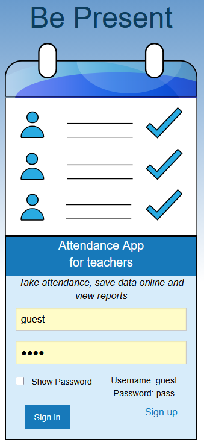
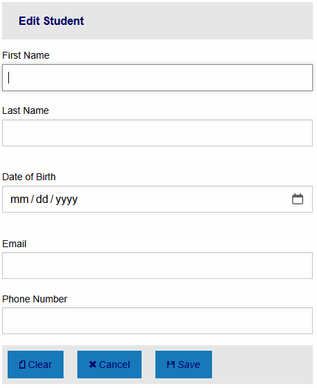
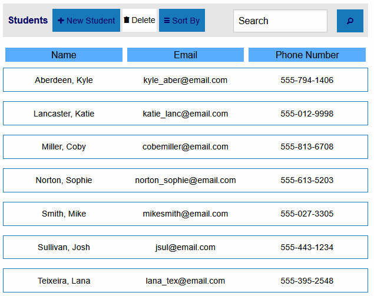
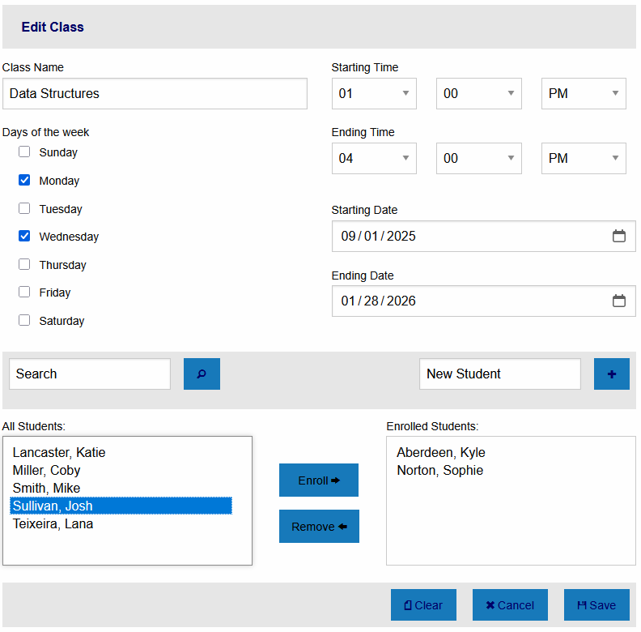
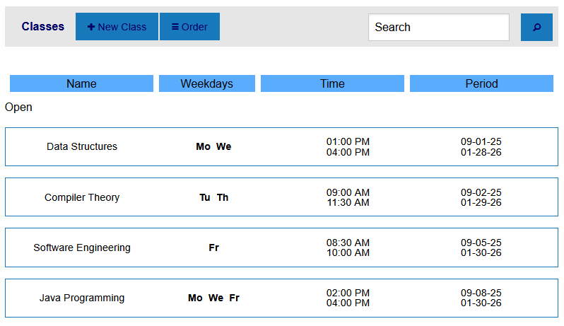
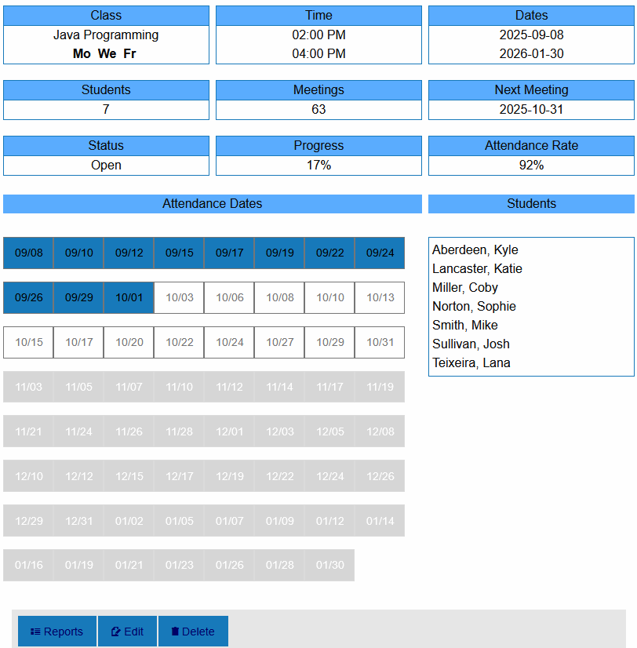
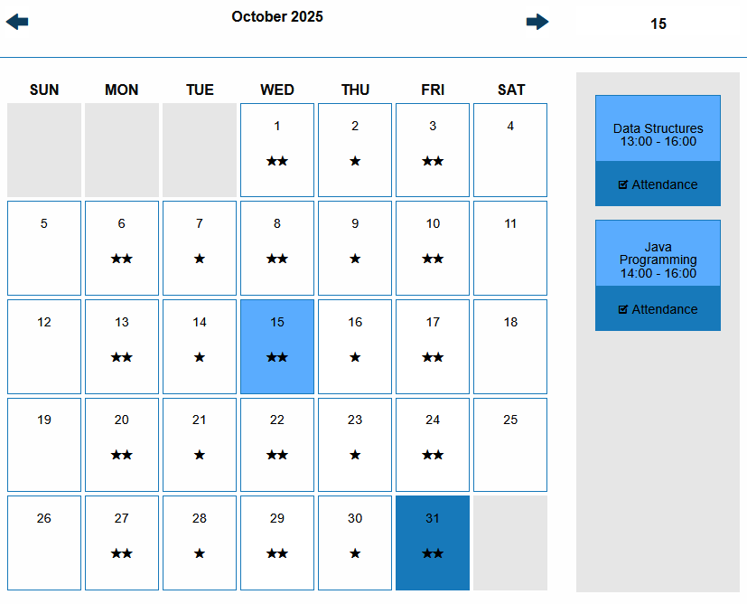
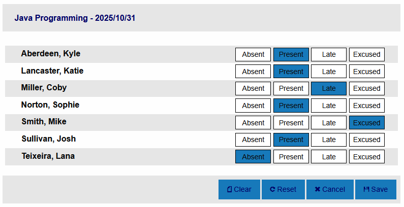
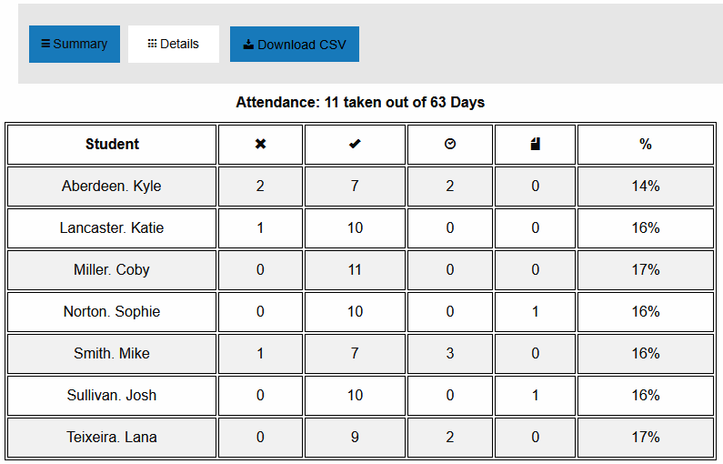
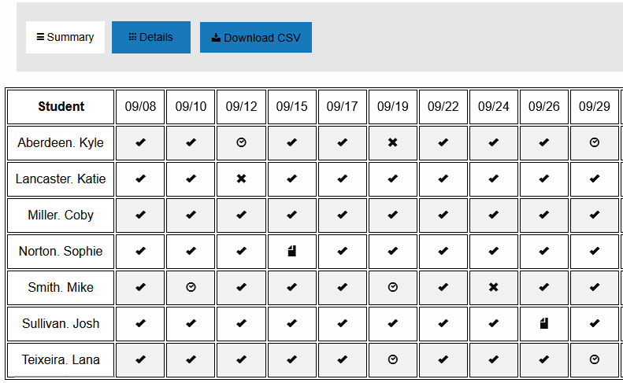

# 📚 Attendance Management System – Technical Documentation

## 1. 📘 Overview / Introduction

### 🎯 Purpose
This web-based application streamlines classroom attendance tracking by allowing educators to:
- Create and manage student and class records
- Take daily attendance
- Generate downloadable attendance reports in CSV format
- Browse classes via a calendar interface

The system enforces scheduling rules to prevent overlapping classes and duplicate class names, and includes quick student entry during class creation.

### 🏗️ System Architecture

The application follows a **client-server architecture**:

- **Frontend**:
    - Built with HTML, CSS, JavaScript
    - Uses the Foundation Framework for responsive UI
    - Renders templates using Jinja

- **Backend**:
    - Developed in Python using Flask Framework
    - Handles routing, business logic, and database operations
    - Connects to a MariaDB database

- **Database**:
    - Stores student, class, and attendance data
    - Enforces constraints for scheduling and uniqueness

### 👥 Target Audience
- **Developers**: Flask, database modeling, 
- **Educators/Admins**: End users managing attendance and reports

---



- Create new Student



- View Students



- Create new Class



- View List of Classes



- View Class Information



- Browse Calendar



- Take attendance



- View Reports





## 2. 🚀 Setting up Project

### 🔧 Dependencies and Prerequisites

| Component     | Required Version |
|---------------|------------------|
| Python        | 3.8+             |
| Flask         | 2.x              |
| MariaDB       | 10.x             |
| Foundation    | 5.x              |

### 🖥️ Environment Setup

- **IDE Recommendations**:
    - PyCharm, VS Code

- **OS Compatibility**:
    - Windows 10/11
    - macOS Ventura or later
    - Linux (Ubuntu 20.04+)

### 📦 Installation Instructions

#### Backend Setup
1. Enter project folder
    ```
    cd bepresent
    ```

2. Create a python virtual environment:
   ```
   python -m venv venv
   source venv/bin/activate  # On Windows: venv\Scripts\activate
    ```

3. Install dependencies
    ```
   pip install -r requirements.txt
   ```

4. Create a new database called attendb with MariaDB
    ```
   create database attendb;
   ```

5. Import the database schema
    ```
   mysql -u root -p attendb < mysql_schema.sql
   ```

6. Run the Flask app
    ```
   flask run
   ```

7. Visit the app at:
    ```
   http://localhost:8080
   ```
